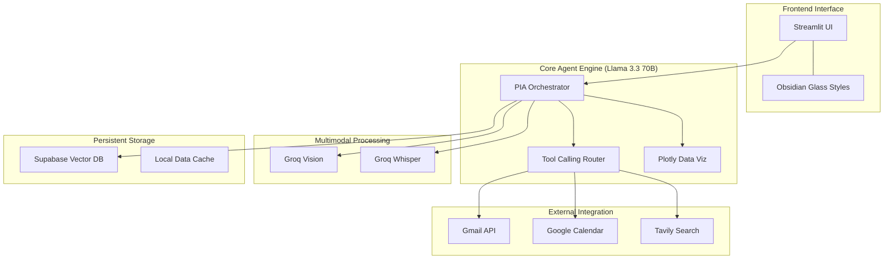

# 🧠 PIA (Personal Intelligence Agent)

### "Your Autonomous AI Copilot for Document Intelligence & Workspace Mastery"

PIA is a premium, feature-rich AI agent built with **Streamlit** and powered by **Meta Llama 3.3 (70B)** and **Groq**. It combines long-term cloud memory (RAG), multimodal analysis (Images, Video, Audio), and deep integration with **Google Workspace (Gmail & Calendar)** to provide a truly autonomous personal assistant experience.

---

## 🎨 Professional "Obsidian Glass" UI
PIA features a bespoke dark-mode interface designed with modern aesthetics in mind:
- **Glassmorphism Design**: Frosted glass effects, smooth gradients, and elegant typography (Manrope & Space Grotesk).
- **Responsive Interactions**: Fade-up animations, custom sidebar navigation, and interactive data visualizations.
- **Unified Command Center**: Seamlessly switch between chat, file analysis, and workspace management.

---

## 🚀 Key Features

### 1. 📂 Intelligent RAG & Document Memory
- **Full-Text Retrieval**: Persistent vector memory using **Supabase (pgvector)**.
- **Multimodal Ingestion**: Supports PDF, DOCX, TXT, CSV, XLSX, and Images.
- **Smart Chunking**: Advanced text processing for high-context retrieval.

### 2. 🌍 Web Intelligence & Search
- **Tavily Integration**: Real-time web searching for current events and market data.
- **Automatic Context Injection**: Detects when a user query requires real-time data and fetches it autonomously.

### 3. 📧 Google Workspace Integration
- **Gmail Automation**: Search, read, summarize, draft, and send emails directly from the chat.
- **Calendar Mastery**: List upcoming meetings and schedule new events using natural language (e.g., "Schedule a sync for tomorrow at 3pm").
- **Forced Tool Calling**: High-reliability intent detection ensures your workspace actions are executed accurately.

### 4. 👁️ Multimodal Vision & Audio
- **Image & Video Analysis**: Powered by Groq's high-speed vision models. Analyze screenshots, photos, and even video frames.
- **Voice-to-Task**: Transcribe voice messages using **Groq Whisper** for hands-free assistant interaction.

### 5. 📊 Data Science & Visuals
- **Auto-Visualization**: Upload tabular data (CSV/XLSX) and PIA will automatically generate Plotly charts (Scatter, Line, Histogram, Bar) based on the data's shape.

---

## 🏗️ System Architecture



---

## 🛠️ Quick Setup

1. **Prerequisites**: Ensure you have Python 3.10+ installed.
2. **Environment**:
   ```bash
   python -m venv .venv
   source .venv/bin/activate  # or .venv\Scripts\activate on Windows
   pip install -r requirements.txt
   ```
3. **Configuration**: Create a `.env` file with your API keys (see `setup_guide.md` for the template).
4. **Database**: Run the `supabase_schema.sql` in your Supabase SQL editor.
5. **Run**:
   ```bash
   streamlit run app.py
   ```

---

## 🛡️ Security & Privacy
PIA is designed with security in mind. All API keys and secrets are managed via `.env` variables and are **excluded** from version control via `.gitignore`. Google OAuth tokens are encrypted locally and never shared.

---

**Developed with ❤️ for Advanced AI Productivity.**
